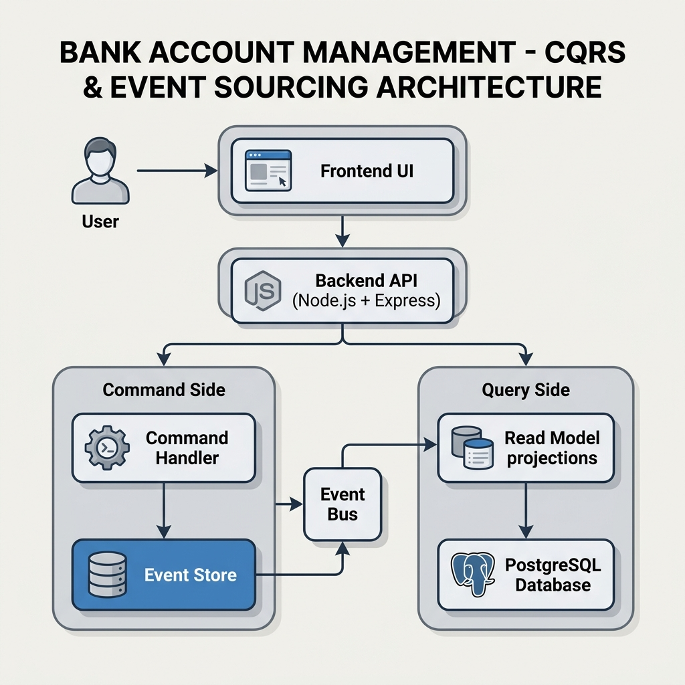

# Bank Account Management System (Event Sourcing & CQRS)

A fully functional bank account management API built with Node.js, Express, and PostgreSQL using **Event Sourcing** and **CQRS** (Command Query Responsibility Segregation) patterns.

## 🚀 Overview

This project implements a highly auditable and scalable banking system where:
-   **Events** are the single source of truth (Event Sourcing).
-   **Read Models** are separated from **Write Models** for optimal query performance (CQRS).
-   **Snapshots** are used to optimize aggregate state reconstruction.
-   **Projections** rebuild read-only summary views asynchronously from the event stream.

## 🏗️ Architecture




-   **Write Side (Commands):** Validates business rules against the current aggregate state and persists events.
-   **Read Side (Queries):** Serves optimized JSON views of accounts and transaction history.
-   **Event Store:** An immutable log of all state changes in PostgreSQL.
-   **Projector:** Processes events and updates the read-model tables (`account_summaries`, `transaction_history`).
-   **Snapshots:** Created every 50 events to minimize history replay time.

---

## 🧠 Why Event Sourcing? (CRUD vs. Event Sourcing)

Traditional database architectures rely heavily on CRUD (Create, Read, Update, Delete) where the application state is directly modified and overwritten. 

*   **The CRUD Overwrite Problem:** In standard CRUD systems, if a user deposits $500 and then withdraws $300, the database simply overwrites the balance column to $200. The detailed historical context of *how* we arrived at $200 is permanently lost unless complex, error-prone auditing tables are manually maintained.
*   **The Event Sourcing Solution:** In this system, every state change is captured as an immutable, append-only event (e.g., `AccountCreated`, `MoneyDeposited`, `MoneyWithdrawn`). State is never overwritten; the current balance is calculated dynamically by replaying the chronological sequence of events. This guarantees 100% audit compliance, absolute data integrity, and effortless fraud detection.

---

## ⚡ Command Query Responsibility Segregation (CQRS)

To maximize performance and scalability, the application strictly separates write operations (Commands) from read operations (Queries).

*   **Write Side (Commands):** Handles incoming state changes. It loads historical events from the Event Store, reconstitutes the aggregate state, validates business rules, and appends new events. It is optimized for high-throughput, sequential writes.
*   **Read Side (Queries):** Handles data retrieval. Asynchronous projectors listen to newly persisted events and update highly optimized, flat read-model tables (`account_summaries` and `transaction_history`).
*   **Core Benefit:** Eliminates database lock contention between read and write operations. Allows the query side to be scaled independently (e.g., using read-replicas) to handle heavy read traffic without impacting transaction validation.

---

## 🛡️ Strategic Architectural Advantages

By combining Event Sourcing and CQRS, this system gains capabilities that are extremely difficult to implement in traditional CRUD architectures:

*   **Temporal Querying (Time-Travel):** Because every historical event is preserved, the system can determine the exact balance and state of any account at any specific millisecond in the past. The API achieves this by replaying the event stream up to the requested historical timestamp.
*   **Perfect System Recovery & Evolution:** If the read-model tables are ever corrupted, or if new reporting requirements emerge, the read models can be cleanly wiped and perfectly reconstructed by replaying the event store from genesis. No historical data is ever lost.

---

## 🛠️ Tech Stack

-   **Backend:** Node.js, TypeScript, Express
-   **Database:** PostgreSQL (with `JSONB` for event payloads)
-   **Documentation:** Swagger UI (OpenAPI 3.0)
-   **Containerization:** Docker, Docker Compose

### 💼 Real-World Enterprise Use Cases
This specific event-driven, segregated architecture mimics tier-1 production systems utilized by Fintech and Web-Scale leaders such as **Monzo, PayPal**, and major Stock Exchanges. Beyond banking, these patterns represent the industry standard for managing high-volume e-commerce inventory systems, audit-critical financial ledgers, and advanced collaborative document versioning.

---

---

## 📦 Setup & Installation

### Prerequisites
-   Docker and Docker Compose installed.

### 1. Configure Environment
Create a `.env` file from the example:
```bash
cp .env.example .env
```

### 2. Start the System
Run the following command to build and start all services:
```bash
docker-compose up --build
```
The API will be available at `http://localhost:8081/api` (or your configured `API_PORT`).

### 3. API Documentation
Interactive Swagger UI is available at:
**`http://localhost:8081/docs`**

---

## 📖 API Usage Guide

### **Commands (Write Operations)**
-   `POST /api/accounts`: Create a new account.
-   `POST /api/accounts/{id}/deposit`: Deposit funds.
-   `POST /api/accounts/{id}/withdraw`: Withdraw funds (checks for sufficient balance).
-   `POST /api/accounts/{id}/close`: Close an account (requires zero balance).

### **Queries (Read Operations)**
-   `GET /api/accounts/{id}`: Get account current status.
-   `GET /api/accounts/{id}/transactions`: Paginated history of deposits and withdrawals.
-   `GET /api/accounts/{id}/events`: Full audit trail (event stream).
-   `GET /api/accounts/{id}/balance-at/{timestamp}`: Time-travel query for historical balance.

### **Administrative**
-   `POST /api/projections/rebuild`: Triggers a full reconstruction of read-model projections from the event store.
-   `GET /api/projections/status`: Shows the lag and status of projections.

---

## 🧪 Testing with Demo Data
The system comes with a pre-seeded account for quick testing:
-   **Account ID:** `acc-test-12345`
-   **Owner:** Jane Doe (from `submission.json`)
-   **Initial Account:** `acc-12345` / John Doe (from seed script)

---

## 🧩 Key Engineering Challenges & Solutions

Building this robust, fault-tolerant ledger system required addressing critical distributed systems and data engineering challenges:

*   **⚡ Challenge 1: Replay Latency & Hydration Bottlenecks**
    *   *Solution:* Implemented automatic **State Snapshotting**. Every 50 events, the aggregate’s stable state is serialized into a `snapshots` table. Reconstituting an account now only reads the latest snapshot and replays relative incremental events, rendering loading speeds constant regardless of historical transaction depth.
*   **🔒 Challenge 2: Data Integrity & Concurrency Control**
    *   *Solution:* Eliminated catastrophic race conditions using **Optimistic Concurrency Control**. By enforcing a composite unique database index on `(aggregate_id, event_number)` and executing version mismatch checks strictly inside atomic SQL `BEGIN` transactions, conflicting updates trigger immediate 409 exception safeties.
*   **🔢 Challenge 3: Arithmetic precision in Floating Point maths**
    *   *Solution:* Adopted dedicated PostgreSQL `DECIMAL` formats to store precision-sensitive assets. Bridged JavaScript’s default string serialization to accurate numeric casts before calculation layers to safeguard against hidden rounding discrepancies.

---

## 🚀 Future Roadmap & Limitations

While this system is designed to showcase high-performance ledger concepts, scaling to global enterprise production would involve:

*   **Out-of-Process Projection:** Currently, projectors run in-process using Express promises. For distributed scalability, projectors should be decoupled into out-of-process consumers listening to a dedicated message broker (e.g., Apache Kafka or RabbitMQ).
*   **Event Schema Evolution (Upcasting):** Over time, business requirements change event structures. Implementing event upcasters would allow old event payloads to be dynamically transformed into newer formats on the fly during aggregate reconstruction.
